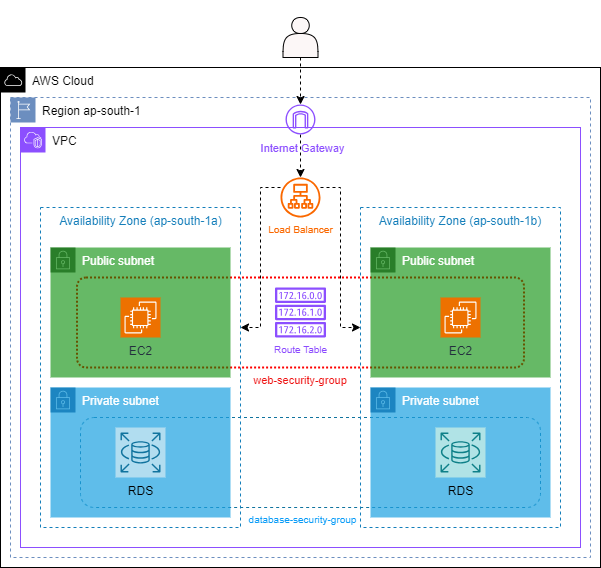

# VPC-terraform-git-actions
Creating VPC terraform as IAAAC and github actions as CI/CD

This Terraform project deploys the following infrastructure on AWS:
A custom VPC having two public. It also has an internet gateway deployed to enable internet traffic within the VPC and route table to which the public subnets are associated.

EC2 instance servers are deployed within the public subnets along with security group attached to them to enable inbound traffic.

An elastic load balancer is created to distribute the incoming traffic across the servers.

Architectural Diagram

Apart from the infrastructure, this project also implements the following Terraform features:
Modularity: Terraform modules are used to build separate components for ec2 , vpc ,alb and sg.

Flexibility: Terraform variables, outputs, and tfvars are used to enable more flexible and modular code by avoiding hard-coded values.

Remote Backend: S3 bucket is configured as a remote backend for storing the Terraform statefile.

Static Checks: Static checks using terraform validate, and terraform plan are performed to check the formatting, validate configurations, and compare the desired state with the actual state, respectively.

Secrets Management: Secrets are managed using Hashicorp Vault and the database credentials are stored securely in the vault.

Project Structure
The project is structured in the following way to manage multiple environments (dev, staging and production) as subdirectories

├── development
│   ├── backend.tf
│   ├── main.tf
│   ├── terraform.tfvars
│   └── variables.tf
├── production
│   ├── backend.tf
│   ├── main.tf
│   ├── terraform.tfvars
│   └── variables.tf
├── staging
│   ├── backend.tf
│   ├── main.tf
│   ├── terraform.tfvars
│   └── variables.tf
└── modules
    ├── compute
    │   ├── main.tf
    │   ├── outputs.tf
    │   ├── userdata.sh
    │   └── variables.tf
    ├── database
    │   ├── main.tf
    │   └── variables.tf
    ├── hashicorp-vault
    │   ├── main.tf
    │   ├── outputs.tf
    │   └── variables.tf
    ├── load-balancer
    │   ├── main.tf
    │   ├── outputs.tf
    │   └── variables.tf
    ├── networking
    │   ├── main.tf
    │   ├── outputs.tf
    │   └── variables.tf
    ├── s3
    │   ├── main.tf
    │   └── variables.tf
    └── statelock
        └── main.tf
